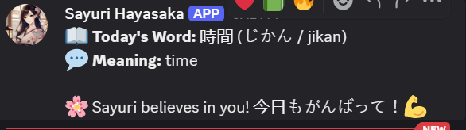

# 🌸 Sayuri Hayasaka — Your Gentle Nihongo Reminder 🌸

> *“Kotoba are petals of the soul... shall we pick one together each day?”* 🍵

Sayuri Hayasaka is a soft-spoken, elegant Discord bot that sends you a daily Japanese word — complete with kana, romaji, meaning, and a whisper of motivation. Designed for those who wish to study Nihongo gently, one petal at a time.

---

## 💖 What Sayuri Does

- 📖 Posts **one Japanese word per day** to a Discord channel
- 🈶 Includes **kanji, kana, romaji, and meaning**
- 🌸 Adds a **motivational Sayuri-style quote**
- 🔁 Automatically runs daily via **GitHub Actions**

---


## 🔧 Setup Instructions

### 1️⃣ Add Your Discord Webhook

1. Go to your Discord server → ⚙️ **Server Settings** → **Integrations** → **Webhooks**
2. Create a new webhook and copy its URL
3. In your GitHub repo:

   * Go to **Settings** → **Secrets and variables** → **Actions**
   * Add a new secret:

     * **Name:** `WEBHOOK_URL`
     * **Value:** your webhook URL


### 2️⃣ Fork or Clone This Repository
```bash
git clone https://github.com/rakinplaban/sayuri-nihongo.git
cd sayuri-nihongo
```

### 3️⃣ Local Setup
1. create a `.env` file.
2. Copy everything from `.env.example` to `.env` file.
3. replace the <webhook_url> with your Discord webhook url on `.env` file.
4. create python virtual environment
5. run `pip install -r requirements.txt`
6. run `python main.py`

---

*You should get message from your webhook name and avatar you set.*




## 🕒 Scheduled Deployment (GitHub Actions)

Sayuri is powered by GitHub Actions and will send a message every day automatically.

📅 **Schedule:** Once per day at 3:00 AM UTC (customizable in `.github/workflows/sayuri.yml`)

To trigger manually, go to the **Actions** tab and click **Run workflow**.

---

## 📁 File Structure

```
sayuri-daily-reminder/
├── main.py          # Main bot script
├── .gitignore       # What github will ignore
├── .env.example     # template of .env file
├── requirements.txt       # Python dependencies
└── .github/
    └── workflows/
        └── sayuri.yml     # GitHub Actions workflow
```

---

## 🌱 Contributing

Feel free to add:

* New words or phrases (with kana, romaji, meaning)
* Daily grammar points or example sentences
* Sayuri voice lines or moods
* Support for audio or text-to-speech

Sayuri welcomes all gentle help\~ 💞

---

## 📜 License

MIT License — you're free to share, learn, and grow. Just don’t forget to say *ありがとう*, ne\~?

---

> *“Little by little, petal by petal… you’ll bloom into fluency. Sayuri will be right here.”* 🌸

```

